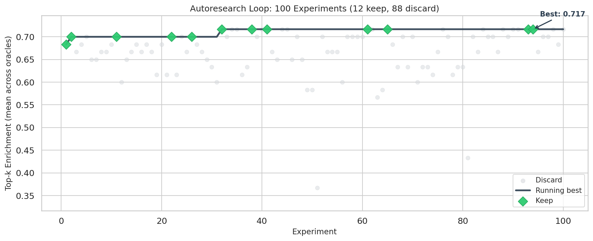
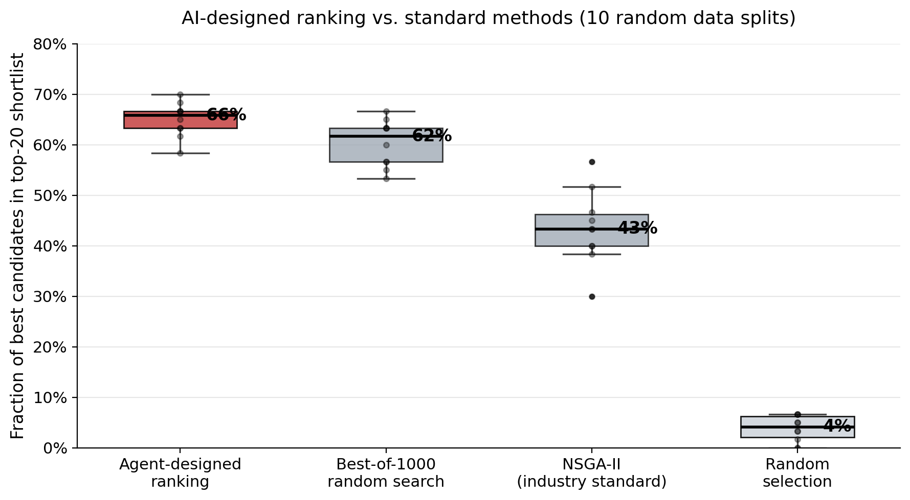
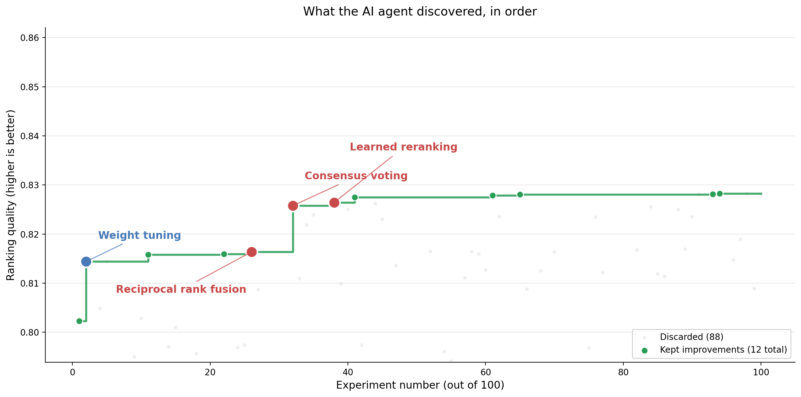

# Lay summaries

Non-technical summaries of the preprint *Agent-Guided Ranking Policy Improvement for Peptide Drug Candidate Prioritization* (bioRxiv, 2026), for readers outside computational methods: program leads, partners, and scientists in adjacent fields. Each summary stands alone.

---

<!-- release: 2026-04-23 -->
## What the work is

Six months ago I wrote the first weighted-sum scorer for our peptide triage. It took an afternoon. It wasn't very good.

Today, the preprint describing what replaced it is live on bioRxiv.

A peptide drug program lives or dies on one question: which handful of candidates do you send to the lab? Picking wrong costs months. Good candidates have to balance four properties at once: they need to work, be safe, stay stable, and be manufacturable. Most tools handle one at a time.

We gave an AI agent one assignment: improve the ranking recipe one change at a time, and only keep changes that pick better candidates on held-out data. It ran 100 experiments and kept 12.

The loop is Andrej Karpathy's autoresearch idea (2026): let an agent edit code against a fixed scoring system. We pointed it at peptide triage.

The result: a median of 66% of the best candidates in the top-20 shortlist, versus 43% for the industry-standard approach, across 10 random data splits. On a public benchmark of 3,554 antimicrobial peptides.

The pipeline plugs into a company's own candidate library. The paper uses public data; the code is built for proprietary programs.

If you're running peptide triage at your company, I'd like to compare notes.

---

<!-- release: 2026-04-28 -->
## The result that surprised us

When we started, I expected our AI-designed ranking recipe to beat a hand-tuned spreadsheet. That would have been a nice result.

What I didn't expect was that it would also beat the field's textbook answer.

For multi-objective problems like peptide triage, NSGA-II is the standard method taught in every optimization course. It's been the default for twenty years. Across 10 random data splits, it surfaces a median of 43% of the best candidates in the top-20 shortlist.

The AI-designed recipe gets 66%. On its worst split, it still beats NSGA-II's best split.

This isn't NSGA-II being bad. It's NSGA-II being designed for the wrong goal. NSGA-II tries to spread candidates across the whole trade-off frontier, because for many problems you want to preserve diversity. But triage isn't about diversity. It's about picking the 20 candidates you'll actually spend lab money on. Concentrated beats diverse when you have a fixed budget.

The lesson for anyone running a benchmark: check whether your optimizer's goal matches the decision you'll actually make with its output.

---

<!-- release: 2026-05-01 -->
## What the agent built on its own

Here's the part of the project I still think about.

We gave the AI agent one job: edit a peptide ranking recipe, keep changes that score better on held-out data. We expected weight-tuning. Adjust this coefficient, boost that feature, average a few scores.

That's what the first twenty experiments looked like. Then it started doing things I didn't ask for.

It began voting across multiple ranking criteria instead of averaging them.

It blended rank lists from different scoring methods using reciprocal rank fusion, a trick from search-engine research that nobody had written into the template.

By the end, it was training small machine-learning models to re-rank its own shortlist.

Three of the 100 experiments that got kept were structural ideas, not parameter tweaks. The agent had moved past the problem I posed and started solving the meta-problem: what kind of recipe works here at all.

This is why Andrej Karpathy's autoresearch idea matters. The loop is simple (agent edits code, harness scores it, keep or revert). The outcomes are not, because the space of changes is as large as the space of code the agent can write.

---

<!-- release: 2026-05-06 -->
## What this is and is not

The part of a paper people skip is the limitations section. Here's ours, in plain English, before anyone asks.

This is not a drug-discovery system. It ranks candidates your program already has. It doesn't invent new peptides.

This is not a replacement for the lab. The output is a shortlist to synthesize and assay. It's triage, not decision.

The benchmark is antimicrobial peptides. We don't know yet how the method transfers to cyclic peptides, GLP-1 analogs, or oncology programs. Peptide chemistry is not one field.

The AI agent runs offline. It doesn't see live assay results. It doesn't take actions. It proposes ranking recipes against a fixed scoring harness, and a human approves each kept change.

The improvements are not guaranteed to transfer. The 65% number is on a public dataset. A proprietary library with different score distributions may behave differently, which is exactly why the pipeline was built to plug into internal data and re-learn.

None of this makes the result less real. It does mean the right question isn't "can AI replace medicinal chemists." The right question is "can AI make the next 20 candidates you send to the lab more likely to work." That's a narrower claim and the one we tested.

---

<!-- release: 2026-05-12 -->
## For programs that want to pilot

<!-- image: none embedded. For sharing, a screenshot of the repo's Quickstart block, or the top of the README, makes the integration feel concrete. Text-only is also fine for this closer. -->

I've been writing about our peptide-triage paper for three weeks. Here's the practical end.

If you run a peptide program with in-house scores for activity, toxicity, stability, and manufacturability, the pipeline we describe is designed to plug into your data with a swapped data loader. Nothing about the agent, the evaluation harness, or the ranking-recipe search needs to change. Only the input table does.

What "plug into" looks like in practice:

One engineer, one to two weeks, to wire your internal scoring into the expected input format.

A single command to launch the agent loop against your data.

A shortlist of top-20 candidates, with the policy that produced it, written to disk.

The agent runs locally on your infrastructure. Your peptide sequences never leave your environment. The public-data pipeline we released is the worked example you swap out.

If that sounds useful for your program, send me a message. I'm interested in a small number of pilots with teams already running peptide triage today.

---

## References

- Preprint: https://www.biorxiv.org/content/10.64898/2026.04.19.719536
- Code: https://github.com/ewijaya/autoresearch-developability
- Prior art: Karpathy, A. *autoresearch* (2026), https://github.com/karpathy/autoresearch
